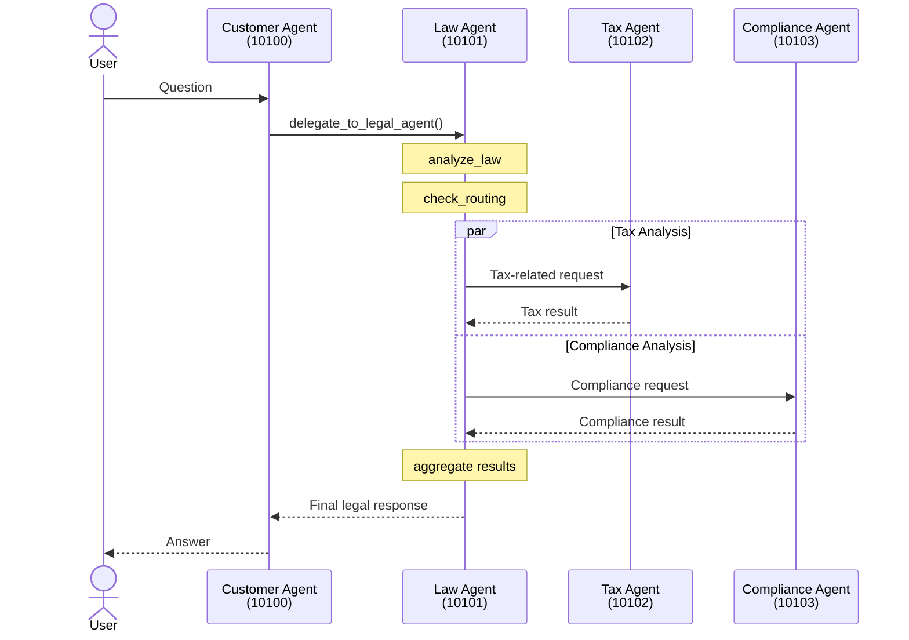

## Trace Flow

Quá trình xử lý request diễn ra như sau:

1. User gửi câu hỏi.
2. Customer Agent nhận request.
3. Customer Agent chuyển tiếp (delegate) sang Law Agent.
4. Law Agent thực hiện:
   - `analyze_law`
   - `check_routing`
5. Law Agent gửi các tác vụ chuyên biệt đến:
   - Tax Agent
   - Compliance Agent
6. Hai agent xử lý song song và trả kết quả về Law Agent.
7. Law Agent tổng hợp kết quả (`aggregate`).
8. Kết quả được trả lại Customer Agent.
9. Customer Agent phản hồi cho User.

---

## Sequence Diagram



---

## Flow Diagram (Simple View)

```text
User
 |
 | Question
 v
Customer Agent (10100)
 |
 | delegate_to_legal_agent()
 v
Law Agent (10101)
 |
 | analyze_law
 |
 | check_routing
 |
 +------------------+
 |                  |
 v                  v
Tax Agent       Compliance Agent
(10102)         (10103)
 |                  |
 +--------+---------+
          |
          v
      Law Agent
      aggregate
          |
          v
   Customer Agent
          |
          v
        User
```

---

## Kết luận

Request được tiếp nhận bởi **Customer Agent (10100)**, sau đó được chuyển sang **Law Agent (10101)** để phân tích và điều phối. Law Agent gọi đồng thời **Tax Agent (10102)** và **Compliance Agent (10103)** để xử lý các nghiệp vụ chuyên biệt. Sau khi tổng hợp kết quả, Law Agent trả phản hồi về Customer Agent và cuối cùng gửi kết quả đến User.